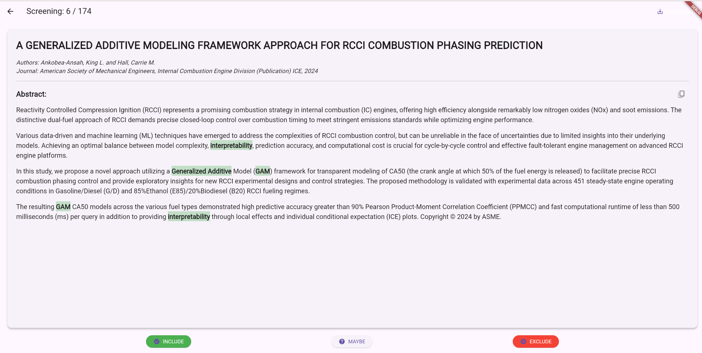

# Focus-Mode SLR Screener

A simple, cross-platform desktop and web application designed to accelerate the screening phase of Systematic Literature Reviews (SLRs). It provides a focused, one-at-a-time view of abstracts with keyword highlighting and other assistive features to make the process faster and more comfortable.



-----

## Features

  - **Load from BibTeX:** Directly loads and parses standard `.bib` files.
  - **Focus Mode:** Displays one abstract at a time in a clean, readable view to minimize distraction.
  - **Intelligent Filtering:** Automatically detects and skips articles that have already been assigned a `group` in a previous session.
  - **Keyword Highlighting:** Automatically highlights custom lists of inclusion and exclusion keywords within the abstract text.
  - **Enhanced Readability:** Breaks long abstracts into smaller, easy-to-read paragraphs.
  - **Simple Decision Making:** Clear `Include`, `Maybe`, and `Exclude` buttons for fast decisions.
  - **Auto-Save & Backup:** Automatically saves your screening progress for each `.bib` file, so you can safely stop and resume your work at any time.
  - **Export Results:** Exports a new, fully updated `.bib` file with your decisions saved in the `groups` field (e.g., `groups = {SLR_INCLUDE}`).

-----

## Tech Stack

  - **Frontend:** Flutter (for cross-platform desktop and web UI)
  - **Backend:** Python with Flask (for the local API server)
  - **Reference Parsing:** `bibtexparser` (Python library)

-----

## Getting Started

Follow these instructions to get a copy of the project up and running on your local machine.

### Prerequisites

Ensure you have the following software installed on your computer:

  - **Git**
  - **Python** (Version 3.10 or newer)
  - **Flutter SDK** (with the `flutter` command available in your terminal/PATH)

### Setup and Installation

**1. Clone the Repository**

**2. Set Up the Python Backend**
*(Run these commands from the top-level project root)*

```bash
# Create a Python virtual environment
python -m venv venv

# Activate the virtual environment
# On Windows:
# .\venv\Scripts\activate
# On macOS & Linux:
source venv/bin/activate

# Install the required Python packages
pip install -r requirements.txt
```

**3. Set Up the Flutter Frontend**
*(Run these commands from inside the slr\_app sub-directory)*

```bash
# Navigate into the Flutter project folder
cd slr_app

# Get all the Flutter dependencies
flutter pub get

# Navigate back to the root for running the app
cd ..
```

### Running the Application

This application requires two processes running at the same time: the backend server and the frontend app. You will need **two separate terminals**.

**1. Configure the Connection (First Time Only)**
The Flutter app needs to know your computer's local network IP address to find the Python server.

  - Find your computer's **Local IP Address** (e.g., `192.168.1.123`) in your Wi-Fi or Network settings.
  - Open the Flutter files (`slr_app/lib/main.dart` and `slr_app/lib/screening_page.dart`).
  - In each file, search for the URL `http://127.0.0.1:5000` and **replace `127.0.0.1`** with your computer's actual Local IP Address.

**2. Start the Backend Server**

  - Open your **first terminal**.
  - Navigate to the project root and activate the virtual environment: `source venv/bin/activate`.
  - Run the Python server:
    ```bash
    python app.py
    ```
  - Keep this terminal open. You should see it running on `http://0.0.0.0:5000`.

**3. Run the Flutter App**

  - Open your **second terminal**.
  - Navigate to the Flutter project sub-directory: `cd path/to/project/slr_app`.
  - Run the app on your desired platform:
    ```bash
    # For desktop 
    flutter run -d windows
    # Or macos, or linux

    # For web (recommended)
    flutter run -d chrome
    ```
  - The application window should now launch. Click "Load .bib File" to begin\!

-----

## License

This project is licensed under the MIT License - see the `LICENSE` file for details.